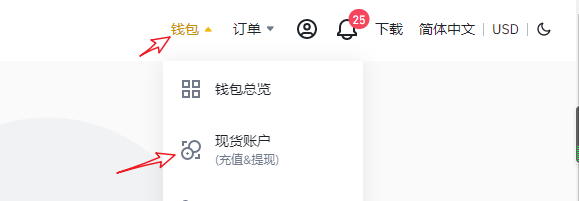
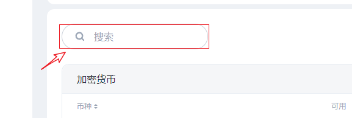
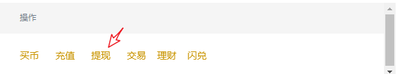
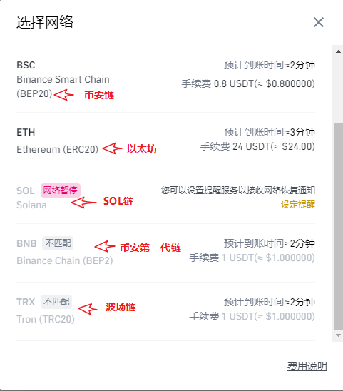
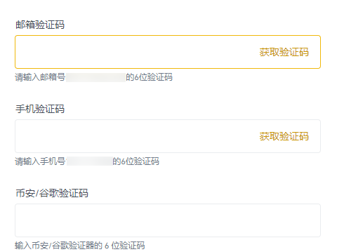

# 币安交易所提币到AnToken

**声明：本教程无投资建议**

当前支持乙太坊EVM的公链越来越多，所以在提币的时候一定要注意的是通道选择问题，稍有不慎用错了通道资产就无法到账，还需要自行找回，浪费了时间和精力，所以小编做了一张图把常用通道和对应的公链做下标注。 **务必核对好通道后再进行充值或提币。**

币安交易所提币到钱包_**（**_[_**https://www.binancezh.biz/zh-CN**_](https://www.binancezh.biz/zh-CN)_**）**_

1、打开币安点击右上角钱包，下拉选择现货帐户。

2、在搜索栏中填入需要提币的代币名称，例如USDT

搜索到USDT代币后，在操作中选择提现功能

3、交易所提币到钱包，最重要的就是收款地址选择和收款网络选择。 （参考顶部通道示意图）

币安交易所会针对填入的收款地址进行匹配，例如填入的是0x开头的地址，会自动遮罩例如binance或TRC20、sol等通道的选择。

钱包中选择和提币网络相同的公链钱包地址收款，在AnToken钱包收款介面顶部有明显的提示。

.jpg)

4、核对好提币地址和网络，设定好提币数量后，币安有多次通道确认提醒，最终确认后填入所需要的验证码后提交，即可完成提币申请操作，接下来就是耐心等待提到账。

