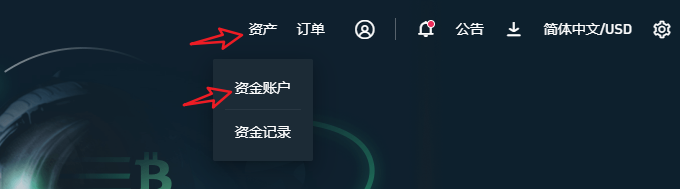
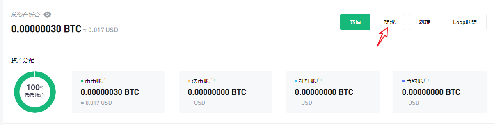
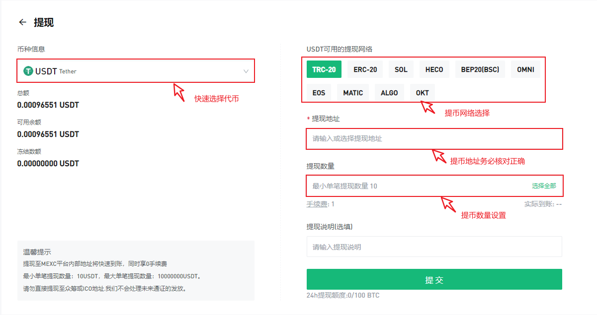

# 抹茶交易所提币到AnToken

**声明：本教程无投资建议**&#x20;

当前支持以太坊EVM的公链越来越多，所以在提币的时候一定要注意的是通道选择问题，稍有不慎用错了通道资产就无法到账，还需要自行找回，浪费了时间和精力，所以小编做了一张图把常用通道和对应的公链做下标注。**务必核对好通道后再进行充值或提币。**

**抹茶交易所提币（**[**https://www.mexc.com/zh-CN**](https://www.mexc.com/zh-CN)**）**

1、登录抹茶交易所，点击**资产**，选择**资金账户**。

2、资产界面选择右上角**提现**

3、仔细阅读提示内容并勾选后点击我已知晓

.png>)

4、提现界面中，可以快速查找和选择代币，选择正确的提币网络，使用对应网络的钱包地址收款地址接收代币，设置好数量后提交，然后填入激活码等内容完成最终的提币申请并耐心等待到账。

