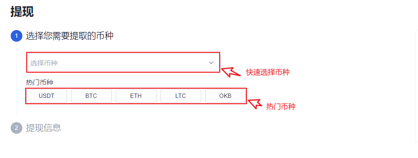
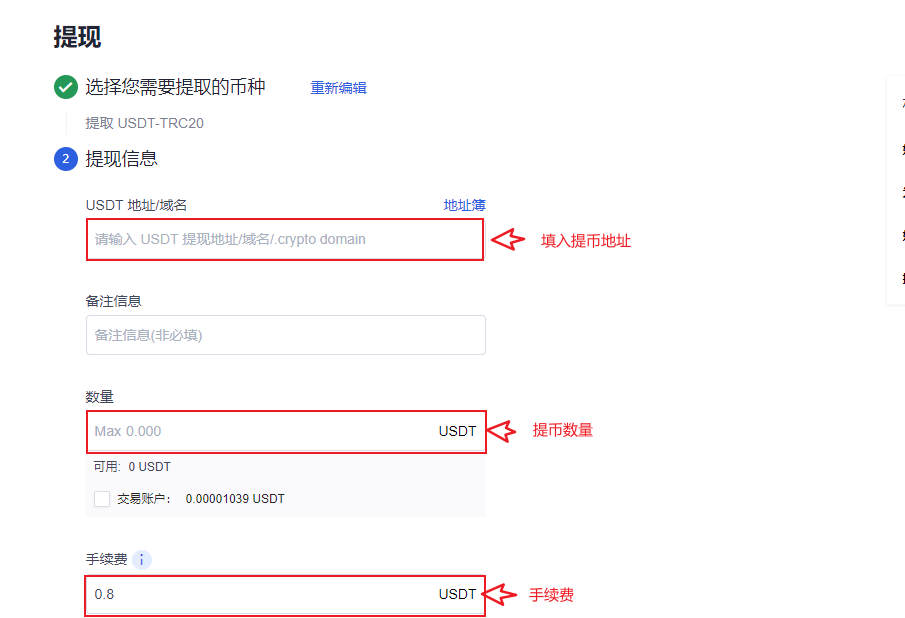

# 欧易交易所提币到AnToken

**声明：本教程无投资建议**

当前支持以太坊EVM的公链越来越多，所以在提币的时候一定要注意的是通道选择问题，稍有不慎用错了通道资产就无法到账，还需要自行找回，浪费了时间和精力，所以小编做了一张图把常用通道和对应的公链做下标注。**务必核对好通道后再进行充值或提币。**

**欧易交易所提币（**[**https://www.ouyi.icu/**](https://www.ouyi.icu/)**）**

1、打开欧易交易所官方并登录账号密码，点击右上角**资产管理**下拉选择**提现**

2、在默认打开的资产总览界面点击提现

3、在提现界面中选择需要提币的代币名称。

4、提现网络中选择需要转出的网络，可以参考顶部的通道示意图。

5、确定后提现网络，填入自己收款地址，设置数量后执行到最后一步填入验证码后完成提币操作。

